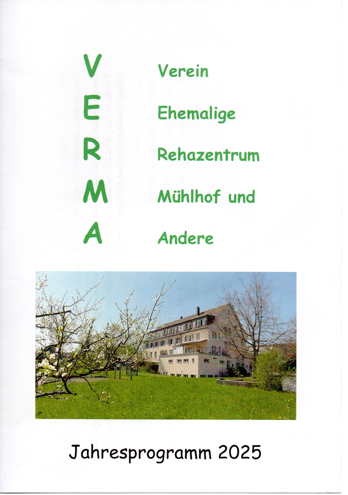
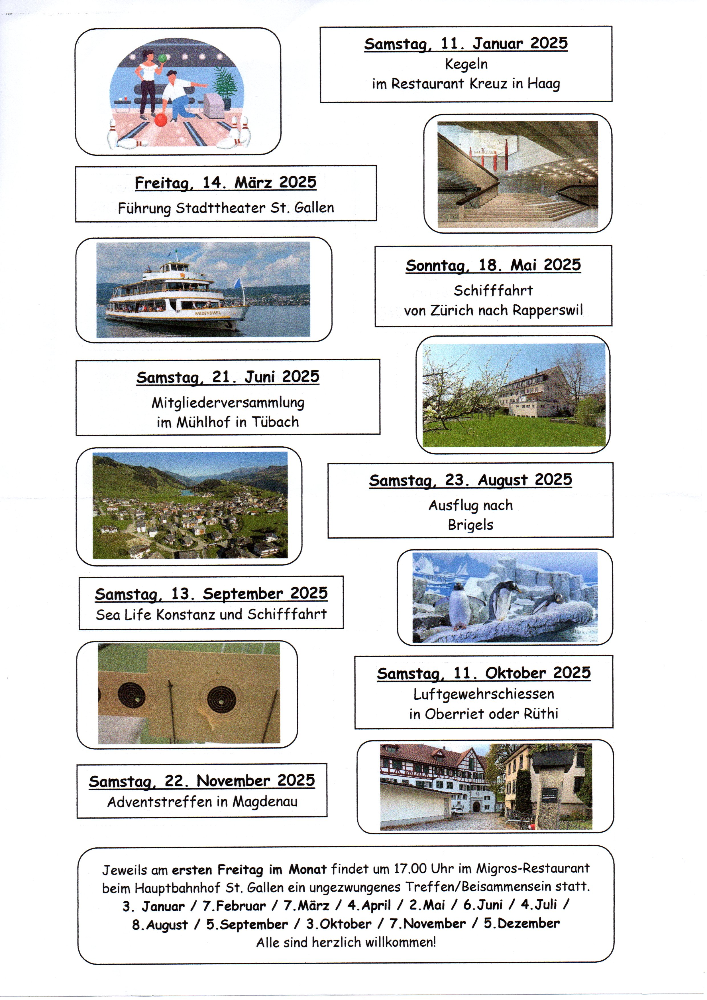

# VERMA – Ein Leuchtturm auf dem Weg in ein alkoholfreies Leben

Willkommen auf der offiziellen Homepage von **VERMA**. Unser Verein ebnet den Weg zu einem erfüllten, alkoholfreien Leben und kann dabei ein Leuchtturm sein für all jene, die sich von der Last der Abhängigkeit befreien möchten. Diese Seite bietet dir einen tiefgehenden Einblick in unsere Geschichte, unsere Mission und unsere vielfältigen Programme.

---

## Inhaltsverzeichnis

- [Über uns](#über-uns)
- [Unsere Mission](#unsere-mission)
- [Unsere Programme](#unsere-programme)
  - [Vorträge & Informationsveranstaltungen](#vorträge--informationsveranstaltungen)
  - [Sportveranstaltungen](#sportveranstaltungen)
  - [Gemeinsame Ausflüge & Treffen](#gemeinsame-ausflüge--treffen)
- [Finanzielle Unterstützung & Sponsoring](#finanzielle-unterstützung--sponsoring)
- [Kontakt](#kontakt)
- [Jahresbericht des Präsidenten](#jahresbericht-des-präsidenten)
- [Mitmachen und Engagement](#mitmachen-und-engagement)

---

## Über uns

**VERMA** wurde von ehemaligen Patientinnen und Patienten des Entzugs am Rehazentrum Mühlhof in Tübach am Bodensee gegründet. Unser Verein besteht aus:

- **Ehemaligen:** Menschen, die den Entzug bereits durchlaufen haben und nun als Wegweiser dienen.  
- **Angehörigen und Freunden:** Personen, die den Betroffenen zur Seite stehen und den Weg ins alkoholfreie Leben mitgestalten.  
- **Interessierten, Unterstützern und Gönnern:** Jeder, der an einem nachhaltigen, suchtfreien Leben interessiert ist.

Wir sind ein gemeinnütziger Verein, der politisch und religiös neutral agiert und allen Beteiligten zeigt, dass ein erfülltes Leben ohne Alkohol nicht nur möglich, sondern auch lohnenswert ist. Aktuell sind wir primär im Kanton St. Gallen aktiv – mit der Vision, unsere Arbeit bald auch in angrenzende Grenzkantone sowie ins Fürstentum Liechtenstein zu tragen.

---

## Unsere Mission

Unsere Mission ist es, Menschen den Ausstieg aus der Abhängigkeit zu erleichtern und ihnen gleichzeitig zu zeigen, wie reich und gesund das Leben ohne Alkohol sein kann. Wir möchten:
- Einen klaren, unterstützenden Weg aus der Sucht aufzeigen.
- Die Gemeinschaft stärken und den sozialen Rückhalt fördern.
- Vorbilder und praktische Lösungsansätze in den Vordergrund rücken.

Unser Ansatz basiert auf Austausch, Gemeinschaft und ganzheitlicher Förderung – sei es in gesundheitlichen, sozialen oder kulturellen Bereichen.

---

## Unsere Programme

Die Stärke von **VERMA** liegt in unserem vielseitigen Angebot, das Menschen direkt im Alltag unterstützt und inspiriert:

### Vorträge & Informationsveranstaltungen

- **Erfahrungsberichte:** Ehemalige teilen ihre persönlichen Geschichten – sie zeigen, dass der Weg aus der Sucht möglich ist.  
- **Fachliche Aufklärung:** Experten bieten Workshops und Vorträge an, die fundierte Informationen sowie praktische Tipps zur Überwindung von Suchtabhängigkeiten liefern.

### Sportveranstaltungen

- **Gemeinsame Aktivitäten:** Sportliche Events fördern die körperliche und seelische Gesundheit gleichermaßen.  
- **Teamgeist und Routinen:** Durch regelmäßige Aktivitäten wird nicht nur der Körper gestärkt, sondern auch der Zusammenhalt und das Vertrauen in die Gemeinschaft.

### Gemeinsame Ausflüge & Treffen

- **Regelmäßige Treffen:** Jeden ersten Freitag im Monat treffen sich die Mitglieder im Migros-Restaurant beim Hauptbahnhof in St. Gallen zu einem entspannten Beisammensein.
- **Vielfältige Aktivitäten:**  
  - Spiele wie Kegeln, Boccia, Boule, Dart usw.  
  - Führungen 
  - Schifffahrten auf dem Rhein, dem Boden- oder Zürichsee
  - Rundgänge in sehenswerten und spannenden Gegenden, Ortschaften oder Städten 
  - Besuche in Betrieben und Industriestandorten
  - Adventstreffen in Magdenau

Diese Aktivitäten schaffen nicht nur positive Erlebnisse, sondern fördern auch den sozialen Zusammenhalt und bestätigen den Weg in eine suchtfreie Zukunft.

---

## Finanzielle Unterstützung & Sponsoring

Manchmal befinden sich Teilnehmer in finanziell herausfordernden Situationen und sind teilweise auf Sozialhilfe angewiesen. Um sicherzustellen, dass niemand aufgrund von Geldmangel vom Vereinsleben ausgeschlossen wird, sind wir auf finanzielle Unterstützung angewiesen:

- **Spendenaufruf:** Jede Spende, egal in welcher Höhe, hilft uns, das vielfältige Angebot aufrechtzuerhalten und zu erweitern.  
- **Sponsoren:** Durch Sponsorenbeiträge können zusätzlich kulturelle Veranstaltungen und Ausflüge realisiert werden, die den Gemeinschaftssinn weiter stärken.
- 
- **Spendenkonto:**
-   
**CH93 8080 8004 8451 4231 9**

**VERMA**,
Tannenstrasse 13,
9463 Oberriet (SG)

Mit deiner Unterstützung trägst du dazu bei, langfristig auch Kosten im Gesundheitswesen zu senken und den Betroffenen einen nachhaltigen Neuanfang zu ermöglichen.

---

## Kontakt

Möchtest du mehr über **VERMA** erfahren oder aktiv dazu beitragen, den Weg in ein alkoholfreies Leben mitzugestalten? Dann freuen wir uns, von dir zu hören!

- **Jakob Zäch**  
Tannenstrasse 13, 9463 Oberriet SG  
E-Mail: [j.zaech@bluewin.ch](mailto:j.zaech@bluewin.ch)

- **Konrad Kals**  
Haldenweg 15c, 8888 Heiligkreuz  

---

## Jahresbericht des Präsidenten

Der Jahresbericht bietet einen emotionalen Rückblick sowie einen Ausblick auf kommende Projekte und Aktivitäten. Einige Highlights des vergangenen Jahres waren:

- **Boccia-Spiel in Rorschach:** Ein Tag, der Spaß und Nähe in der Gemeinschaft förderte.
- **Führungen im Kloster Einsiedeln:** Inspirierende Einblicke in spirituelle und historische Hintergründe.
- **Schifffahrten und Rundgänge:** Erlebnisse wie die Schifffahrt zur Insel Ufenau oder der Rundgang in Burgau stärkten Körper und Seele.
- **Boule-Spiele und Treffen:** Aktivitäten, die soziale Kontakte intensivieren und den Gemeinschaftsgeist stärken.
- **Adventstreffen in Magdenau:** Ein Fest der Gemeinschaft in einer besinnlichen Atmosphäre.

Präsident Jakob Zäch fasst zusammen, dass sämtliche Aktivitäten und das Miteinander den Glauben bestärken, dass ein alkoholfreies Leben voller Freude, Unterstützung und gemeinsamer Erlebnisse liegt.

---

## Mitmachen und Engagement

**VERMA** lebt von der aktiven Beteiligung seiner Mitglieder. Wir laden dich herzlich ein, dich einzubringen:

- **Ideen & Vorschläge:** Hast du innovative Ideen für neue Veranstaltungen oder Unterstützungsprojekte? Deine Meinung zählt!
- **Mitgliedschaft:** Werde Teil unserer Gemeinschaft und gestalte aktiv den Weg in eine suchtfreie Zukunft.
- **Freiwilligenarbeit:** Unterstütze uns bei der Organisation von Events und trage dazu bei, dass unsere Gemeinschaft wächst.

Gemeinsam können wir ein starkes Zeichen setzen und den Weg in ein gesundes, erfülltes Leben nachhaltig gestalten.

---

**VERMA – Ein Leuchtturm auf dem Weg in ein alkoholfreies Leben**  
Mit deinem Beitrag und der Unterstützung der gesamten Gemeinschaft arbeiten wir jeden Tag daran, Menschen zu inspirieren und ihnen einen neuen, lebensfrohen Weg aufzuzeigen.

*Vielen Dank für dein Interesse und dein Engagement!*
